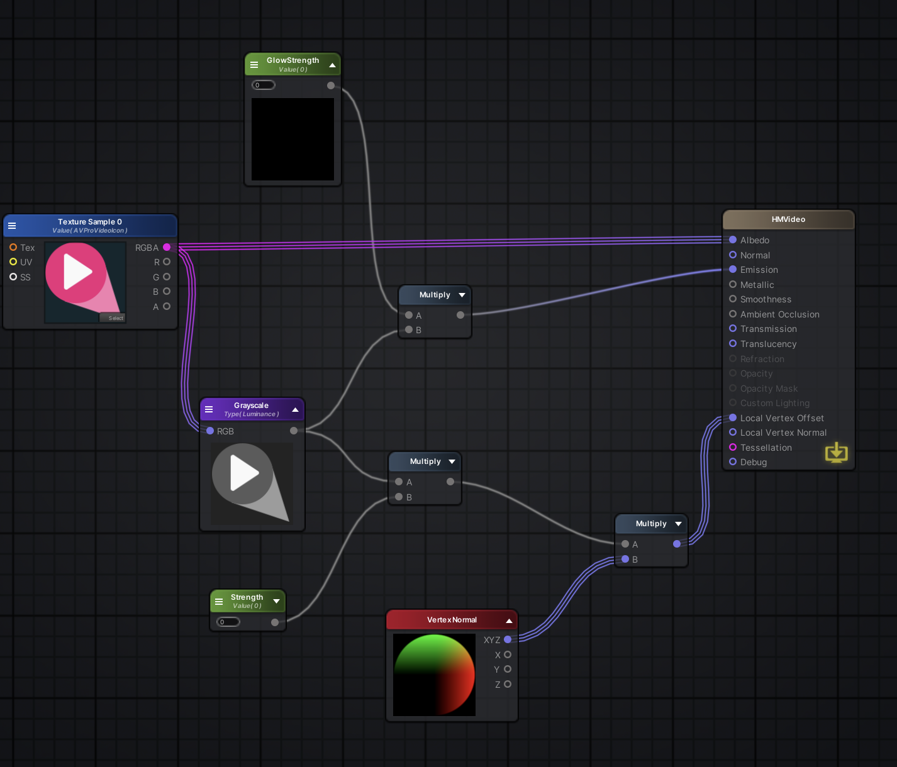

# MagicScreen

This is a simple LCD Screen with pixel height for VR raves. There are two Meshes, apply the material to one of the meshes and then output a video as texture to the material texture.
 
## Amplify Shader Graph

## Examples

